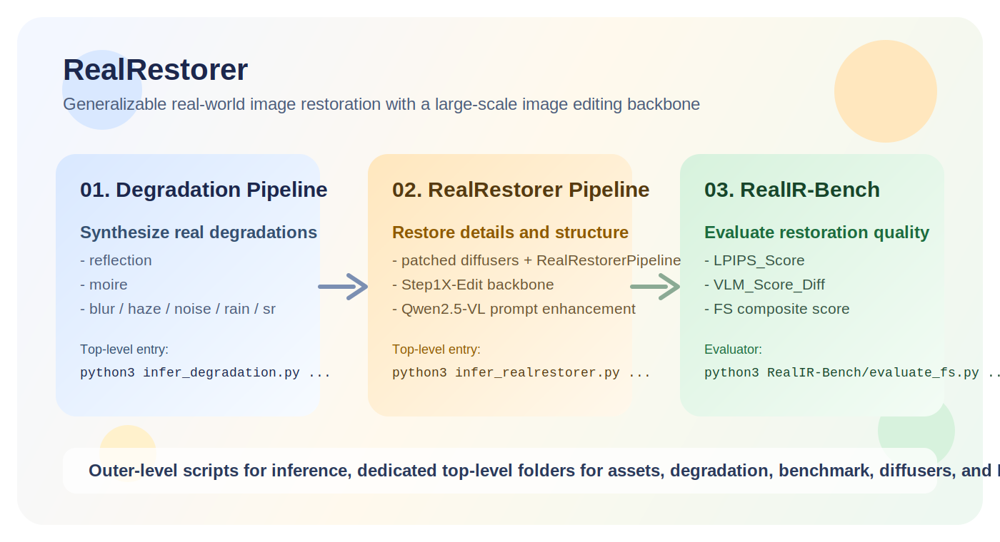

<div align="center">
  <h2>RealRestorer: Towards Generalizable Real-World Image Restoration with Large-Scale Image Editing Models</h2>
  <p>
    A practical RealRestorer workspace with standalone model inference, degradation synthesis, and benchmark evaluation.
  </p>
  <p>
    <a href="https://arxiv.org/abs/PAPER_ID"></a>
    <a href="https://YOUR_PROJECT_PAGE"></a>
    <a href="https://gitlab.basemind.com/i-yangyufeng/RealRestorer"></a>
    <a href="https://huggingface.co/YOUR_ORG/RealRestorer"></a>
    <a href="https://huggingface.co/datasets/YOUR_ORG/RealIR-Bench"></a>
    <a href="https://huggingface.co/spaces/YOUR_ORG/RealRestorer-Demo"></a>
  </p>
</div>

> [!NOTE]
> Replace the placeholder public links above with the final arXiv, project page, Hugging Face, benchmark, and demo URLs before release.

<p align="center">
  
</p>

RealRestorer packages three things in one place:

- a `RealRestorerPipeline` workflow built on a patched local `diffusers`
- a standalone `degradation_pipeline` for synthesizing real-world degradations
- a lightweight `RealIR-Bench` evaluator for restoration benchmarking

## 🔥 Updates

- [03/2026] Top-level script entries `infer_realrestorer.py`, `infer_degradation.py`, and `evaluate_realir_bench.py` are ready for direct use.
- [03/2026] The standalone degradation pipeline is moved into this repository under `degradation_pipeline/`.
- [03/2026] The repository layout is cleaned up into `assets`, `degradation_pipeline`, `RealIR-Bench`, `diffusers`, and `RealRestorer`.

## ✅ Action Items

- [x] `infer_realrestorer.py` for packaged-model inference
- [x] `infer_degradation.py` for synthetic degradation generation
- [x] `evaluate_realir_bench.py` for benchmark evaluation
- [ ] Qwen-Image-2511 version

## 🚀 Quick Start

### 1. Model Links

- RealRestorer model: `https://huggingface.co/YOUR_ORG/RealRestorer`
- RealIR-Bench download: `https://huggingface.co/datasets/YOUR_ORG/RealIR-Bench`
- Demo: `https://huggingface.co/spaces/YOUR_ORG/RealRestorer-Demo`

### 2. Installation

This project does **not** use the upstream PyPI `diffusers` package. You must install the patched local `diffusers/` checkout that already contains `RealRestorerPipeline`.

```bash
cd /data/yfyang/project/RealRestorer-diffuser/diffusers
python -m pip install -e .

cd /data/yfyang/project/RealRestorer-diffuser
python -m pip install -r requirements.txt
python -m pip install -e .
```

A full `pip list` export from the working `kontext` environment is also provided in `requirements_kontext_full.txt`.

If you also want to run the benchmark evaluator, install the extra dependencies:

```bash
cd /data/yfyang/project/RealRestorer-diffuser
python -m pip install -r RealIR-Bench/requirements.txt
```

You can verify the environment with:

```bash
python -c "from diffusers import RealRestorerPipeline; print(RealRestorerPipeline.__name__)"
```

### 3. Recommended Inference Config

- Device: `cuda`
- Torch dtype: `bfloat16`
- Inference steps: `28`
- Guidance scale: `3.0`
- Recommended seed: `42`
- Recommended prompt: `Restore the details and keep the original composition.`
- Reflection benchmark prompt: `Please remove the reflection from the image.`

### 4. Top-Level Scripts

- `python3 infer_realrestorer.py ...` for RealRestorer inference
- `python3 infer_degradation.py ...` for synthetic degradation generation
- `python3 evaluate_realir_bench.py ...` for RealIR-Bench evaluation

## 🧩 Inference Scripts

### RealRestorer Inference

If you already have an exported or packaged RealRestorer bundle:

```bash
python3 infer_realrestorer.py \
  --model_path /path/to/realrestorer_bundle \
  --image /path/to/input.png \
  --prompt "Restore the details and keep the original composition." \
  --output /path/to/output.png \
  --device cuda \
  --torch_dtype bfloat16 \
  --num_inference_steps 28 \
  --guidance_scale 3.0 \
  --seed 42
```

If you want to assemble a self-contained bundle from source checkpoints first:

```bash
python3 -m RealRestorer.export_bundle \
  --load /path/to/realrestorer_checkpoint \
  --save_dir /path/to/realrestorer_bundle \
  --model_path /path/to/shared_models \
  --ae_path /path/to/vae_weights \
  --qwen2vl_path /path/to/Qwen2.5-VL-7B-Instruct \
  --device cuda \
  --torch_dtype bfloat16
```

Then run `infer_realrestorer.py` on the exported bundle.

## 🌫️ Degradation Pipeline

The standalone degradation pipeline is wrapped by `infer_degradation.py` and supports:

- `blur`
- `haze`
- `noise`
- `rain`
- `sr`
- `moire`
- `reflection`

Reflection synthesis follows the CLI style you requested:

```bash
python3 infer_degradation.py \
  --image /path/to/input.png \
  --degradation reflection \
  --reflection_ckpt_path /path/to/130_net_G.pth \
  --reflection_image /path/to/reflection.png \
  --output /path/to/output.png
```

The script writes metadata to a JSON file next to the output image by default.

## 📊 Benchmark Evaluation

`evaluate_realir_bench.py` is the outer-level entry for paired-directory evaluation. It compares:

- one reference directory
- one prediction directory with the same relative file names

and outputs three aggregated metrics for the selected task:

```text
LPIPS_Score = mean(LPIPS)
VLM_Score_Diff = mean(VLM_Score_Diff)
FS = mean(0.2 * VLM_Score_Diff * (1 - LPIPS))
```

Example evaluation command:

```bash
python3 evaluate_realir_bench.py \
  --ref-dir /path/to/reference_dir \
  --pred-dir /path/to/prediction_dir \
  --task reflection \
  --vlm-model-path /path/to/Qwen3-VL-8B-Instruct
```

If you want per-image details as well, add:

```bash
--output-csv /path/to/results.csv
```

The underlying evaluator implementation remains in `RealIR-Bench/evaluate_fs.py`, while the release-facing script stays at the repository root together with the inference entries.

## 🗂️ Project Structure

```text
RealRestorer-diffuser/
├── evaluate_realir_bench.py   # top-level benchmark evaluation entry
├── infer_realrestorer.py      # top-level RealRestorer inference entry
├── infer_degradation.py       # top-level degradation synthesis entry
├── assets/                    # teaser and README assets
├── degradation_pipeline/      # standalone degradation synthesis package
├── RealIR-Bench/              # benchmark evaluation tools
├── diffusers/                 # patched local diffusers with RealRestorerPipeline
├── RealRestorer/              # export and inference utilities
├── docs/                      # installation notes
├── examples/                  # minimal usage examples
├── requirements.txt
└── pyproject.toml
```

The repository keeps the inference scripts at the outermost level, while the model-side implementation and degradation logic live in dedicated top-level folders for easier maintenance and release packaging.

## 📜 License and Disclaimer

The code of RealRestorer is intended to be released under the Apache License 2.0, while the RealRestorer model and associated benchmark assets are intended for non-commercial academic research use only.

**License Terms:**  
The RealRestorer model is distributed under a non-commercial research license. All underlying base models, including the patched `diffusers`, Qwen2.5-VL, and other third-party components, remain governed by their original licenses and terms. Users must comply with all applicable upstream licenses when using this project.

**Permitted Use:**  
This project may be used for lawful academic research, analysis, and non-commercial experimentation only. Any form of commercial use, redistribution for profit, or use that violates applicable laws, regulations, or ethical standards is prohibited.

**User Obligations:**  
Users are solely responsible for ensuring that their use of the model, benchmark, and any derived outputs complies with relevant laws, institutional review requirements, and third-party license terms.

**Disclaimer of Liability:**  
The authors, developers, and contributors provide this project on an "as is" basis and make no warranties, express or implied, regarding accuracy, reliability, or fitness for a particular purpose. They are not liable for damages, losses, or legal claims arising from the use or misuse of this project.

**Acceptance of Terms:**  
By downloading, accessing, or using this project, you acknowledge and agree to the applicable license terms and legal requirements, and you assume full responsibility for all consequences resulting from your use.

## 📑 Citation

If you find this project useful in your research, please consider citing:

```bibtex
@article{yang2026realrestorer,
  title={RealRestorer: Towards Generalizable Real-World Image Restoration with Large-Scale Image Editing Models},
  author={Yufeng Yang and Xianfang Zeng and Zhangqi Jiang and Fukun Yin and Jianzhuang Liu and Wei Cheng and Jinghong Lan and Shiyu Liu and Yuqi Peng and Gang Yu and Shifeng Chen},
  journal={arXiv preprint},
  year={2026}
}
```
